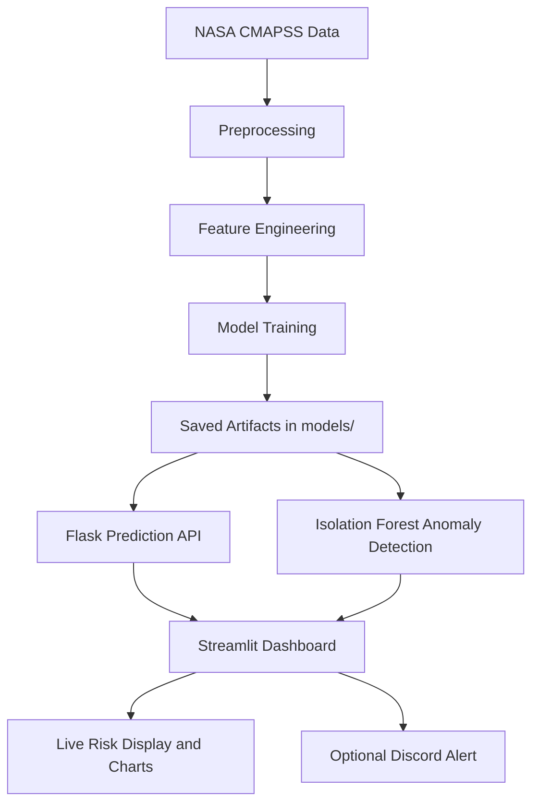
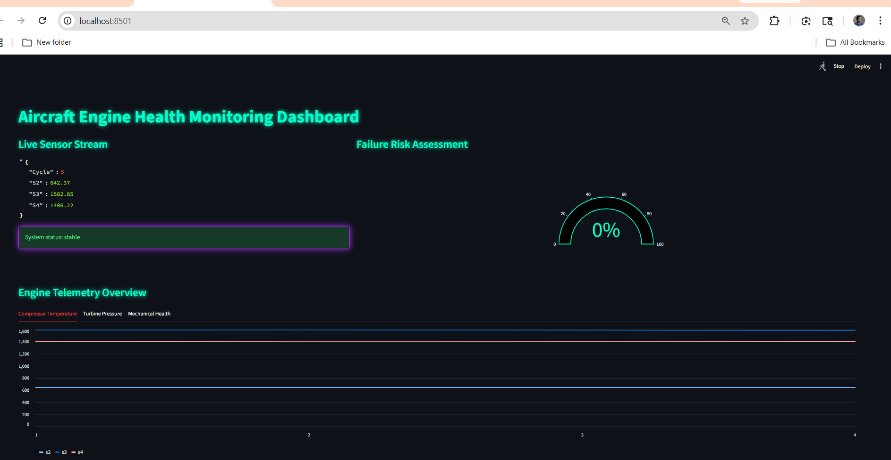
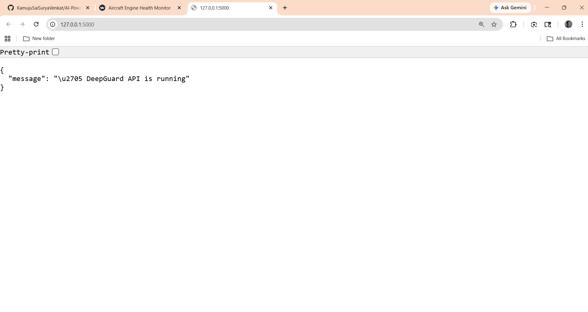
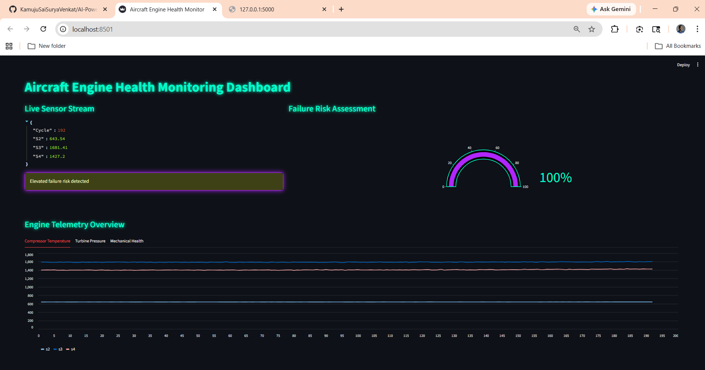
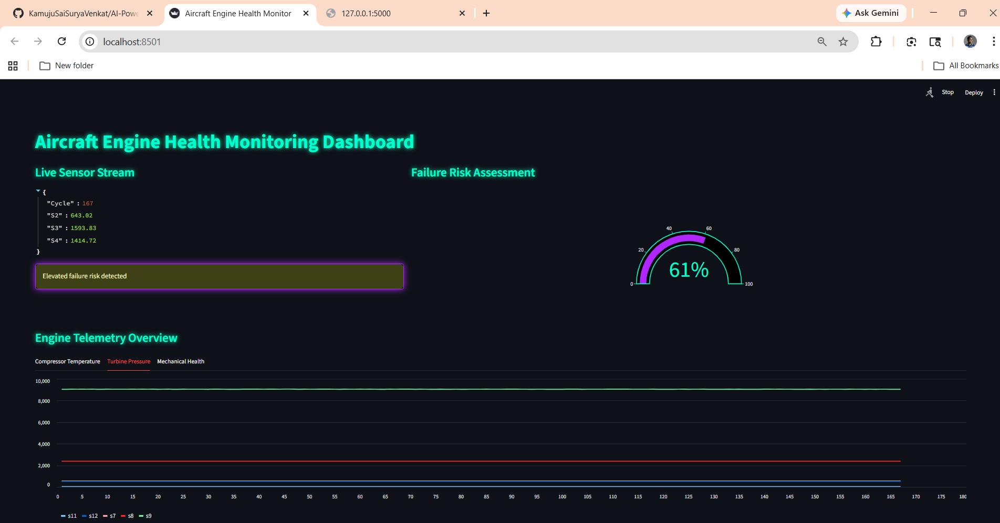

# Aircraft Engine Health Monitoring System

## Overview
This project is a predictive maintenance system for aircraft engine telemetry. It combines supervised failure prediction, unsupervised anomaly detection, a Flask inference API, and a Streamlit dashboard to simulate a real-time monitoring workflow for industrial IoT systems.

The system uses NASA CMAPSS engine data to estimate failure risk from multivariate sensor readings, visualize live telemetry, and trigger alerts when abnormal patterns appear.

## Problem Statement
Modern aircraft engines generate large volumes of telemetry data, but manual inspection is not sufficient to detect early signs of degradation. The goal of this project is to:

- predict whether an engine is approaching failure,
- detect unusual telemetry patterns that may indicate anomalies,
- provide interpretable live monitoring for operators,
- and reduce the risk of unplanned downtime through early intervention.

## Industry Relevance
Predictive maintenance is widely used in aviation, manufacturing, energy, rail, and fleet operations. In the aviation domain, early identification of component degradation can help:

- reduce unscheduled maintenance events,
- improve safety and reliability,
- optimize maintenance schedules,
- lower operational cost,
- and extend asset life.

This project demonstrates a practical end-to-end monitoring pipeline that can be adapted to other industrial sensor systems.

## Tech Stack
- Python
- pandas
- numpy
- scikit-learn
- joblib
- Flask
- Streamlit
- Plotly
- Requests

## Dataset
The project uses the NASA CMAPSS turbofan engine dataset provided in the `data/` folder.

### Files included
- `train_FD001.txt`
- `test_FD001.txt`
- `RUL_FD001.txt`
- Additional FD002, FD003, and FD004 files are also included for reference.

### Data format
Each row contains:
- engine id,
- cycle number,
- three operating settings,
- and 21 sensor measurements.

### Feature engineering approach
The training pipeline currently focuses on FD001 and:
- computes Remaining Useful Life (RUL),
- creates a binary label where failure within 30 cycles is marked as `1`,
- and selects a subset of informative sensors for model training.

Selected sensors:
`s2, s3, s4, s7, s8, s9, s11, s12, s13, s14, s15, s17, s20, s21`

## Architecture
The project follows a simple production-style flow:



### Main components
- `src/preprocess.py` loads and cleans the raw NASA text data.
- `src/feature_engineering.py` computes RUL and failure labels.
- `src/model_train.py` trains a Random Forest classifier and an Isolation Forest detector.
- `src/predictor.py` loads the trained model artifacts and returns failure probability.
- `src/anomaly.py` checks the same telemetry against the anomaly model.
- `api/app.py` exposes a Flask endpoint for prediction requests.
- `dashboard/streamlit_app.py` visualizes live telemetry, failure risk, and anomaly status.
- `src/alert_system.py` prepares Discord alert payloads for critical events.

## Installation
### 1. Clone the repository
```bash
git clone https://github.com/KamujuSaiSuryaVenkat/AI-Powered-Predictive-Maintenance-for-IoT-Devices.git
cd AI-Powered-Predictive-Maintenance-for-IoT-Devices
```

### 2. Create and activate a virtual environment
On Windows PowerShell:
```powershell
py -m venv venv
.\venv\Scripts\Activate.ps1
```

### 3. Install dependencies
```bash
pip install -r requirements.txt
```

### 4. Train the models
The API and dashboard expect the model artifacts to exist in `models/`.
```bash
py src/model_train.py
```

This generates:
- `models/nasa_model.pkl`
- `models/anomaly.pkl`
- `models/scaler.pkl`
- `models/features.pkl`

## Usage
### Run the Flask API
```bash
py api/app.py
```
The API will start on `http://127.0.0.1:5000`.

Available endpoint:
- `GET /` returns a simple service status message
- `POST /predict` accepts sensor JSON and returns prediction, probability, and alert state

### Run the Streamlit dashboard
In a second terminal:
```bash
streamlit run dashboard/streamlit_app.py
```
The dashboard streams generated telemetry, shows a live failure-risk gauge, and plots grouped sensor trends.

### Run the command-line demo
```bash
py main.py
```
This script iterates through generated engine telemetry and prints the prediction and alert output.

### Optional Discord alerts
If you want live Discord notifications, replace the placeholder webhook in `src/alert_system.py` with your actual webhook URL.

## Results
The current implementation produces a working predictive maintenance workflow with these outputs:

- binary failure prediction from the Random Forest model,
- probability score for imminent failure,
- anomaly flag from the Isolation Forest model,
- live telemetry visualization in Streamlit,
- API-based inference for external integration,
- and persistent log generation in `logs/log.csv`.

### Practical outcome
- The dashboard can flag stable, elevated-risk, and anomaly conditions in near real time.
- The API can be consumed by other services or monitoring tools.
- The training pipeline saves reusable model artifacts for repeatable inference.

### Note on metrics
This repository currently focuses on the end-to-end system flow. If you want a formal benchmark section, you can add accuracy, precision, recall, F1-score, and confusion matrix results after evaluating on a held-out test split.

## Screenshots

### Dashboard Overview



### API Response



### Live Alert State




Recommended screenshots:

```markdown


```

Suggested captions:
- Dashboard overview with live telemetry and risk gauge
- Sample API response from the prediction endpoint
- Alert state when anomaly or elevated risk is detected

## Learning Outcomes
This project demonstrates how to:

- preprocess industrial time-series sensor data,
- engineer useful labels from Remaining Useful Life values,
- train a supervised failure classifier,
- combine supervised and unsupervised monitoring models,
- expose predictions through a Flask API,
- build a live Streamlit operations dashboard,
- and structure a small machine learning system for practical deployment.

## Project Structure
```text
Project-5/
|-- api/
|   |-- app.py
|-- dashboard/
|   |-- streamlit_app.py
|-- data/
|   |-- train_FD001.txt
|   |-- test_FD001.txt
|   |-- RUL_FD001.txt
|-- logs/
|   |-- log.csv
|-- models/
|-- src/
|   |-- alert_system.py
|   |-- anomaly.py
|   |-- data_simulator.py
|   |-- feature_engineering.py
|   |-- logger.py
|   |-- model_train.py
|   |-- predictor.py
|   |-- preprocess.py
|-- main.py
|-- requirements.txt
```

## Future Improvements
- Add formal evaluation metrics on a held-out test split.
- Parameterize the engine id used by the simulator.
- Store the Discord webhook securely in environment variables.
- Add deployed screenshots and a benchmark table.
- Extend the pipeline to FD002, FD003, and FD004.
